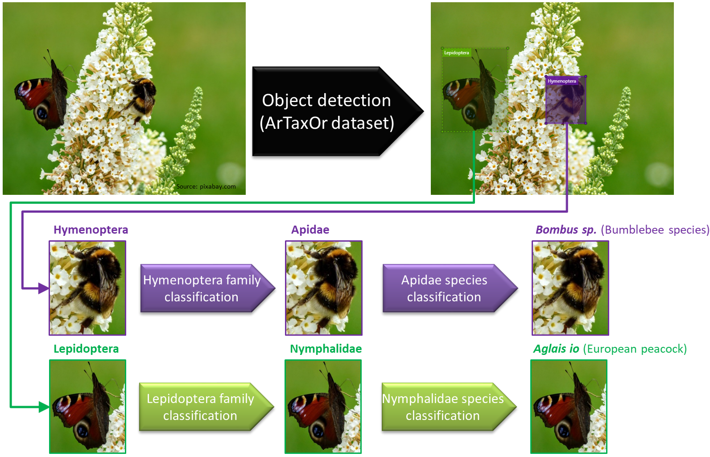

# ArTaxOr models
This respository contains trained models and related files for the Arthropod Taxonomy Order dataset. The [ArTaxOr](https://www.kaggle.com/mistag/arthropod-taxonomy-orders-object-detection-dataset) dataset is used to train object detection models to detect invertebrate animals in images as a first step in a species identification pipeline.

## Trained models
Model name | ArTaxOr revision | Average Precision (0.5 IoU) | Comment
------------ | ------------- | ------------- | -------------
TensorFlow/AutoML | 1.0.0 | 0.773 | Training stopped after 20h

